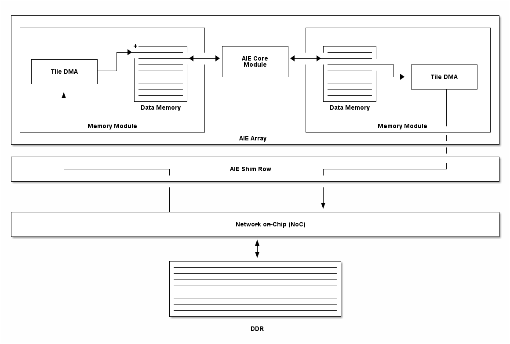
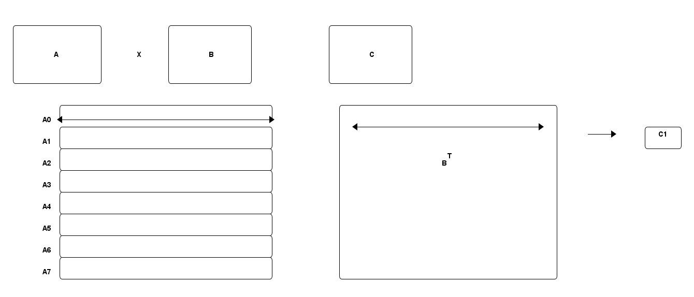
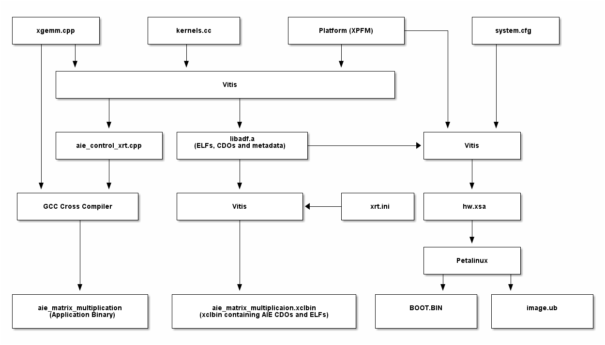
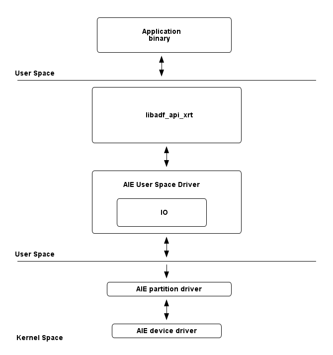

# AI Engine: GMIO Matrix Multiplication Example

The AI Engine matrix multiplication example demonstrates how to use AI Engine for scalar computation and use GMIO attributes for data movement. This example implements the standard matrix multiplication algorithm to multiply two matrices on the AIE cores. The user can change the matrix size and the number of cores utilized at compile-time. The default size is 1200x1200 (int32). The matrix could be further scaled to utilize the entire AIE's local data memory.

Please note that this example is a proof of concept only. There could be other implementations that could leverage more AI Engine resources and result in better performance figures.

## Introduction

Consider two matrices A and B, the product of the two, i.e. AxB, is a linear combination of the columns of A by matrix B. This means that the elements in a row (i) of A are multiplied with the elements in a column of B (j) and are summed up to give the corresponding single element in the matrix AxB at i, j. This means that if A is an n x m matrix and B is an m x p matrix, then the corresponding product AxB would have dimensions n x p. Note how the number of columns of A equals the number of rows in B to make the matrix multiplication possible.

## Implementation

### Data movement

The application uses the GMIO attribute to make external memory-mapped connections to and from global memory. These connections are created between the AIE kernel and the logical global memory port of the hardware platform design via a Network on Chip (NoC). In this design, the buffer descriptors are programmed in the AIE Shim DMAs to initiate AIE to DDR read and write transactions from the PS program. The burst length of the memory-mapped transaction is 64-bit, and shim DMAs use physical memory addressing read/write data from global memory.



### Data slicing

To compute matrix multiplication on AIE, matrix A is sliced horizontally and distributed equally among all the core utilized through the AIE AXI-Stream network. Matrix B is transposed and feed to the first core in the design element by element. The first core shares the input matrix B with the other AIE cores through the AXI-Stream connection. As the output is in a z-order, hence a re-ordering of the output matrix is required.



## Build Flow

The following graph explains the build flow for GMIO based AI Engine designs.



Vitis generates `aie_control_xrt.cpp`, which is cross-compiled to run on the target. The compiled application loads the generated AIE ELFs and CDOs (packaged into XCLBIN) to the corresponding tile through load XCLBIN API.

## Run-time Execution

At runtime, Linux application binary calls AI Engine userspace driver, and runtime library, libadf_api_xrt.a. AIE userspace drivers abstract the kernel-space driver which handles runtime configurations along with ELF loading.



## Sample Output

Follow the PetaLinux boot process to boot the Linux on the target. At the Linux login prompt, login with the user as **root** and password as **root**.

The AIE XCLBIN and executable are pre-installed in the `/usr/bin/` directory.

```
root@xilinx-vck190-2021_1:~# aie-matrix-multiplication
Initializing ADF API...
[INFO] AIE GMIO Matrix Multiplication
[INFO] Matrix size(int32): 1200x1200
[   32.203331] zocl-drm axi:zyxclmm_drm: zocl_create_client: created KDS client for pid(807), ret: 0
[   32.212235] zocl-drm axi:zyxclmm_drm: zocl_destroy_client: client exits pid(807)
[   32.219765] zocl-drm axi:zyxclmm_drm: zocl_create_client: created KDS client for pid(807), ret: 0
[   32.263546] [drm] found kind 29(AIE_RESOURCES)
[50096.973]Loading PDI from DDR
[50097.059]Monolithic/Master Device
[50100.223]3.216 ms: PDI initialization time
[50104.108]+++Loading Image#: 0x0, Name: aie_image, Id: 0x1C000000
[50109.922]---Loading Partition#: 0x0, Id: 0x0
[50165.454] 51.393 ms for Partition#: 0x0, Size: 19074224 Bytes
[50168.293]Subsystem PDI Load: Done
[   32.263563] [drm] found kind 18(PDI)
[   32.358785] [drm] FPGA Manager load DONE
[   32.370722] [drm] skip kind 8(IP_LAYOUT) return code: -22
[   32.374651] [drm] skip kind 9(DEBUG_IP_LAYOUT) return code: -22
[   32.380049] [drm] found kind 25(AIE_METADATA)
[   32.385978] [drm] skip kind 7(CONNECTIVITY) return code: -22
[   32.390330] [drm] skip kind 6(MEM_TOPOLOGY) return code: -22
[INFO] XCLBIN download complete
[INFO] AIE cores are done executing
[INFO] Running sanity check
[INFO] XGeMM Success!
[   32.396205] [drm] zocl_xclbin_read_axlf 3aa4954d-c654-d1b3-e9ec-eaf99ec1e13b ret: 0
[   30.388666] zocl-drm axi:zyxclmm_drm: zocl_destroy_client: client exits pid(807)
root@xilinx-vck190-2021_1:
```

## Customizing and Rebuilding

The AIE application source files are in the `aie_app` directory.

As mentioned earlier, the user can change the number of AIE cores utilized for matrix multiplication. However, since the data memory immediately available to the core is limited, reducing the number of AIE cores reduces the maximum matrix size supported by the application. Within the `config.h` header file, `NUM_HW_ROWS` and `NUM_HW_COLS` macro can be set to change the number of cores utilized. The maximum number of AIE cores available is 400.

To rebuild, run make again to recreate Linux boot images. Build artifacts are available in `sw/vck190_linux/images/linux/` directory.

## References
* [AI Engine Programming Environment User Guide](https://www.xilinx.com/html_docs/xilinx2021_1/vitis_doc/yii1603912637443.html).
* [Vivado Design Suite User Guide](https://www.xilinx.com/support/documentation/sw_manuals/xilinx2021_1/ug973-vivado-release-notes-install-license.pdf).
* [Vitis User Guide](https://www.xilinx.com/html_docs/xilinx2021_1/vitis_doc/acceleration_release_notes.html).
* [Versal Technical Reference Manual](https://www.xilinx.com/products/silicon-devices/acap/versal-ai-core.html?resultsTablePreSelect=xlnxdocumenttypes:Architecture%20Manuals#documentation).
